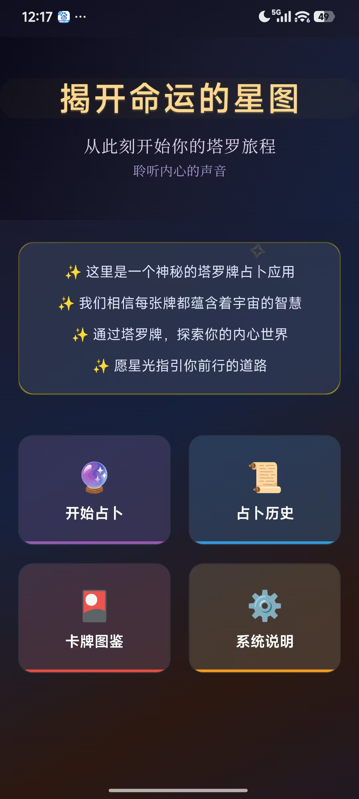
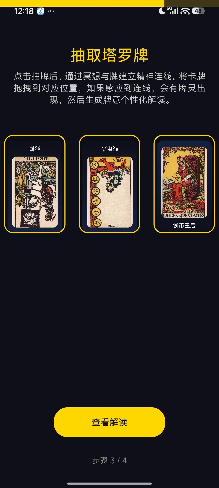
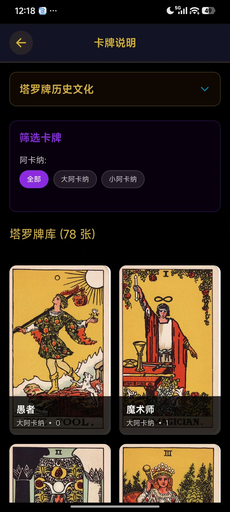
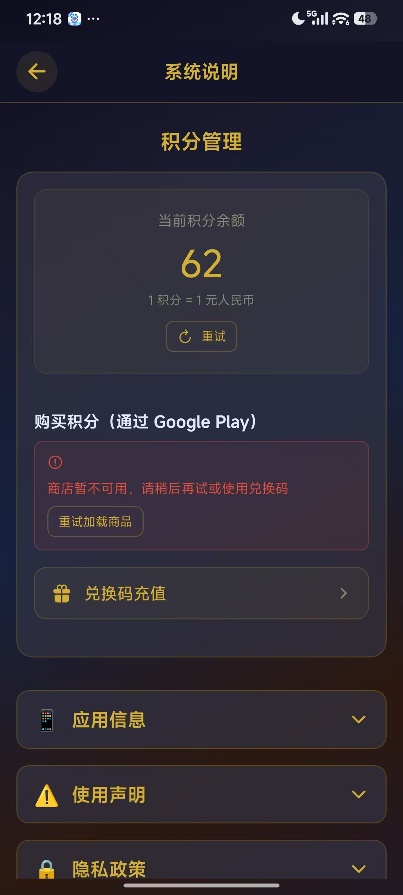
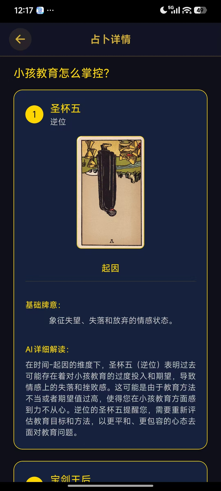

# TarotAI

[](https://github.com/bin448482/tarotAI)
[](https://expo.dev/)
[](https://reactnative.dev/)
[](https://fastapi.tiangolo.com/)
[](https://nextjs.org/)
[](https://docs.docker.com/compose/)

TarotAI is a cross-platform tarot reading product with a mobile reading experience, AI-assisted interpretations, credit-based monetization, and a web admin console.

This README is written from a product perspective: what the product does, who it serves, how the experience works, and where the implementation lives.

## Table of Contents

- [Start Here](#start-here)
- [Why This Product](#why-this-product)
- [Product Preview](#product-preview)
- [Core User Journey](#core-user-journey)
- [Product Strengths](#product-strengths)
- [Product Design Details](#product-design-details)
- [Feature Map](#feature-map)
- [Product Modules](#product-modules)
- [Repository Layout](#repository-layout)
- [Quick Start](#quick-start)
- [API Notes](#api-notes)
- [Public Sharing Notes](#public-sharing-notes)
- [Roadmap](#roadmap)
- [Contributing](#contributing)
- [License](#license)

## Start Here

If you want to understand the product before reading the code, follow this path:

1. Review the screenshots in [Product Preview](#product-preview).
2. Read [Core User Journey](#core-user-journey) to understand the main customer flow.
3. Read [Feature Map](#feature-map) to see what is already supported.
4. Read [Product Design Details](public_docs/product-design.md) for the product rationale behind offline/basic readings, AI readings, history, card library, multilingual support, credits, anonymous identity, and admin operations.
5. Use [Quick Start](#quick-start) only when you are ready to run the project locally.
6. For public-facing product and agent documentation, see [`public_docs/`](public_docs/).

## Why This Product

Tarot apps often split into two weak experiences: simple card lookup tools with little guidance, or AI chat products without a structured tarot flow. TarotAI combines both:

- a guided mobile reading journey for casual users;
- a complete tarot card library for self-learning;
- AI-generated interpretation for personalized questions;
- credits, redemption codes, and purchase channels for monetization;
- a web admin console for user, credit, order, and operations management.

The product goal is simple: help users ask a question, draw cards, receive a clear interpretation, and keep a history they can revisit.

## Product Preview

| Home | Draw Cards | AI Reading |
| --- | --- | --- |
|  |  |  |

| Card Library | Credits & System Info |
| --- | --- |
|  |  |

## Core User Journey

1. **Enter the app**  
   The user lands on a mystical tarot-style home screen with clear entry points: start reading, reading history, card guide, and system information.

2. **Choose a reading path**  
   The reading flow guides the user through a four-step experience: choose mode, describe intent, draw cards, and view the interpretation.

3. **Draw cards**  
   The user draws tarot cards and places them into the spread. The app supports card orientation and position-based meaning.

4. **Read the result**  
   The result combines basic tarot meaning with optional AI detail. AI readings are designed to answer the user's specific question rather than only explain generic card meaning.

5. **Keep or continue**  
   Users can revisit reading history, browse the tarot card library, or manage credits for future AI readings.

## Product Strengths

| Strength | Product advantage |
| --- | --- |
| Offline-first value | `tarot-ai-generator` pre-produces rich card-and-dimension interpretations, so users can complete a basic reading without payment, registration, backend availability, or live AI. |
| Structured tarot ritual | AI enhances the familiar tarot flow instead of turning the product into a generic chatbot. |
| Two-tier interpretation | Basic readings build trust; AI readings provide premium personalization. |
| Dimension-based prompts | Each card has a clear analytical role, making readings more coherent and less generic. |
| Local content plus live AI | The generator creates reviewable bundled tarot content; live AI adds question-specific depth only when needed. |
| History and card library | Past readings increase retention; card details build learning value and trust. |
| Backend payment control | The backend verifies Google Play purchases, processes redemption codes, updates balances, and records orders/transactions instead of trusting the client. |
| Credits plus redemption codes | Monetization works through app-store purchases while still supporting fallback recharge paths. |
| Anonymous identity plus admin tools | Users start quickly, while operators can still manage credits, orders, redemption-code campaigns, and support cases. |

## Product Design Details

For a deeper product explanation, see [`public_docs/product-design.md`](public_docs/product-design.md). It covers why TarotAI includes offline/basic readings, AI readings, reading history, a full card library, multilingual support, credits, anonymous identity, and admin operations.

## Feature Map

| Area | User value | Status |
| --- | --- | --- |
| Anonymous access | Users can start without registration friction. | Implemented |
| Guided reading flow | Users always know the next step. | Implemented |
| Tarot card library | Users can learn card meanings independently. | Implemented |
| Basic interpretation | Users get value even without paid AI usage. | Implemented |
| AI interpretation | Users receive personalized multi-dimensional readings. | Implemented |
| Reading history | Users can revisit previous readings. | Implemented |
| Credits | AI usage can be controlled and monetized. | Implemented |
| Redemption codes | Operators can grant credits without app-store purchase dependency. | Implemented |
| Google Play purchase path | Android monetization path for supported devices. | In progress |
| Admin dashboard | Operators can manage users, credits, codes, orders, and metrics. | Implemented |
| Local reading history | Users can revisit completed readings on the device. | Implemented |
| Cross-device history sync | Better continuity across devices and reinstall scenarios. | Planned |

## Product Modules

### Mobile App

The mobile app is the customer-facing product. It focuses on emotional clarity, simple navigation, and a complete reading flow.

Main experiences:

- mystical home screen;
- four-step tarot reading flow;
- card draw interaction;
- reading result page;
- history list;
- 78-card tarot library;
- credits, redemption, and system information.

### Backend Service

The backend is the payment and control plane for AI readings. It supports anonymous identity, balance checks, credit deductions, Google Play purchase verification, redemption-code recharge, order records, transaction history, admin adjustment, and operational dashboards. Users are represented by a stable anonymous installation identity, with optional email binding when purchase verification provides one.

### Admin Web Console

The admin console is for operations and product management. It supports user management, credit adjustment, redemption-code management, order visibility, dashboard metrics, and system monitoring.

### AI Content Generator

The generator is an internal content tool for producing and maintaining tarot interpretation material. It helps keep static interpretation content structured and reusable.

## Repository Layout

```text
.
├── my-tarot-app/        # Expo React Native mobile app
├── tarot-backend/       # FastAPI backend service
├── tarot-admin-web/     # Next.js admin console
├── tarot-ai-generator/  # Python AI content generation tool
├── deploy/              # nginx and deployment assets
├── pics/                # Product screenshots used by this README
└── public_docs/         # English public documentation, including product-design.md
```

## Quick Start

### Docker

```bash
git clone https://github.com/bin448482/tarotAI.git
cd tarotAI

cp tarot-backend/.env.example tarot-backend/.env
# Edit tarot-backend/.env before production use.

docker compose up -d --build
```

Default local endpoints:

- Personal portal: `http://localhost/`
- Admin console: `http://localhost/admin/`
- Backend health: `http://localhost:8001/health`
- Backend Swagger: `http://localhost:8001/docs`

### Local Development

Backend:

```bash
cd tarot-backend
python -m venv .venv
pip install -r requirements.txt
uvicorn app.main:app --reload --host 0.0.0.0 --port 8000
```

Admin console:

```bash
cd tarot-admin-web
npm ci
npm run dev
```

Mobile app:

```bash
cd my-tarot-app
npm ci
EXPO_PUBLIC_API_BASE_URL=http://<YOUR_LAN_IP>:8000 npx expo start -c
```

## API Notes

Key product APIs:

| Method | Path | Product purpose |
| --- | --- | --- |
| `POST` | `/api/v1/users/register` | Create anonymous user identity. |
| `GET` | `/api/v1/cards` | Load tarot card data. |
| `GET` | `/api/v1/spreads` | Load available spreads. |
| `POST` | `/api/v1/readings/analyze` | Analyze user intent and recommend reading dimensions. |
| `POST` | `/api/v1/readings/generate` | Generate a personalized tarot interpretation. |
| `POST` | `/api/v1/payments/google/verify` | Verify Google Play purchase and credit the user. |

## Public Sharing Notes

This repository is intended to be shareable as public source code. Before publishing a new public release, do not include:

- `.env` files or real API keys;
- production databases;
- private deployment credentials;
- Google service-account private keys;
- keystores, certificates, or signing secrets;
- private logs, local debug bundles, or machine-specific configuration.

Use example configuration files for documentation and keep real production data outside the repository.

## Roadmap

Near-term product work:

- finish Google Play purchase verification and user-facing purchase polish;
- improve offline history and sync behavior;
- refine reading-history review experience;
- add more operational metrics for conversion, credit usage, and AI-reading success rate;
- prepare production deployment documentation.

## Contributing

Contributions should preserve the product experience and the public-sharing boundary. Use safe sample data, keep screenshots and docs generic, and avoid committing credentials or private deployment material.

## License

No license file is currently included. Add a license before publishing or distributing this project as open source.
