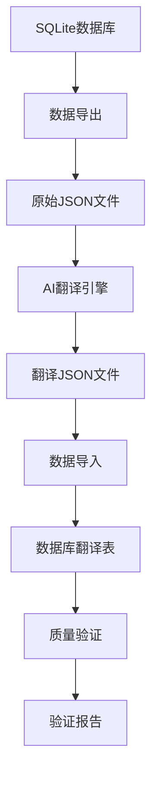

# 塔罗牌翻译系统设计文档 (CLAUDE.md)

## 📖 项目概述

**塔罗牌翻译系统** 是一个独立的AI驱动翻译解决方案，专门用于将塔罗牌占卜相关的中文内容翻译为专业的英文。该系统完全独立运行，不依赖项目的其他模块，采用OpenAI API实现高质量的塔罗牌术语翻译。

## 🎯 设计目标

- **专业术语准确性**: 确保塔罗牌名称、占卜术语翻译的标准化
- **翻译一致性**: 维护整个数据库的术语统一性
- **模块化设计**: 每个组件职责单一，易于维护和扩展
- **质量可控**: 完整的验证和质量检查机制
- **成本优化**: 合理的API调用策略和成本控制

## 🏗️ 系统架构

```
translation/
├── 📁 核心引擎
│   ├── translation_config.py         # 配置管理
│   └── ai_translation_engine.py      # AI翻译引擎
├── 📁 数据处理
│   ├── export_database_raw.py        # 数据导出
│   ├── translate_database.py         # 主翻译流程
│   └── import_database_translated.py # 数据导入
├── 📁 质量保证
│   ├── validate_translation_quality.py # 质量验证
│   └── generate_translation_report.py # 报告生成
├── 📁 翻译资源
│   ├── prompts/                      # 翻译提示词模板
│   ├── translation_glossary.json     # 术语词典
│   └── output/                       # 输出文件
└── 📁 文档
    ├── claude.md                     # 设计文档
    └── readme.md                     # 使用说明
```

## 🔧 核心组件设计

### 1. 配置管理 (translation_config.py)

**设计原则**: 集中化配置管理，支持多环境

**核心功能**:
- AI API配置（OpenAI密钥、模型、参数）
- 数据库路径配置
- 批处理参数优化
- 表映射关系管理

**关键特性**:
```python
class TranslationConfig:
    - AI配置自动验证
    - 路径自动创建
    - 配置完整性检查
    - 环境变量支持
```

### 2. AI翻译引擎 (ai_translation_engine.py)

**设计原则**: 独立、高效、可扩展的AI调用架构

**核心功能**:
- OpenAI API客户端管理
- 异步批处理机制
- 智能重试和错误处理
- 术语词典预翻译
- 翻译结果解析

**关键特性**:
```python
class AITranslationEngine:
    - 独立的API客户端
    - 异步并发处理
    - 术语词典集成
    - 智能响应解析
    - 详细的统计信息
```

### 3. 数据流程管理

#### 3.1 数据导出 (export_database_raw.py)
- 从SQLite数据库导出原始中文数据
- 标准化JSON格式输出
- 数据完整性验证
- 导出统计和报告

#### 3.2 主翻译流程 (translate_database.py)
- 协调整个翻译流程
- 支持单表或全表翻译
- 成本预估和用户确认
- 进度跟踪和状态报告

#### 3.3 数据导入 (import_database_translated.py)
- 批量导入翻译结果到数据库
- 事务保证数据一致性
- 现有翻译清理和替换
- 导入验证和统计

### 4. 质量保证系统

#### 4.1 质量验证 (validate_translation_quality.py)
- **完整性检查**: 验证翻译覆盖率
- **一致性检查**: 术语统一性验证
- **质量检查**: 翻译内容质量评估
- **数据库集成验证**: 确保导入正确性

#### 4.2 报告生成 (generate_translation_report.py)
- 详细的翻译统计报告
- 质量评估和问题汇总
- 成本分析和使用统计
- 改进建议和下一步行动

## 📊 翻译表映射

| 源表 | 翻译表 | 翻译字段 | 特殊处理 |
|------|--------|----------|----------|
| card | card_translation | name, deck, suit | 标准塔罗牌名称 |
| dimension | dimension_translation | name, category, description | 占卜术语统一 |
| spread | spread_translation | name, description | 牌阵名称标准化 |
| card_interpretation | card_interpretation_translation | summary, detail | 保持占卜语气 |

## 🤖 AI翻译策略

### 提示词设计

**核心原则**:
- 专业塔罗牌术语指导
- 明确的输出格式要求
- 上下文信息和背景说明
- 质量标准和一致性要求

**示例结构**:
```
系统角色: 专业塔罗牌翻译专家
任务描述: 翻译塔罗牌相关内容
输入格式: 结构化的中文内容
输出要求: 标准英文JSON格式
质量标准: 术语一致性、专业性
```

### 术语词典管理

**自动创建**: 系统首次运行时自动创建默认术语词典
**手动维护**: 支持人工编辑和扩展
**智能应用**: 翻译前自动应用术语词典

**核心术语**:
- 大阿卡纳: The Fool, The Magician, The High Priestess...
- 小阿卡纳: Ace of Wands, Two of Cups...
- 牌组: Wands, Cups, Swords, Pentacles
- 方向: Upright, Reversed
- 维度: Emotional, Career, Spiritual...

## 🔍 质量控制机制

### 1. 翻译前验证
- 数据完整性检查
- 配置参数验证
- API连接测试

### 2. 翻译过程控制
- 批处理大小优化
- 速率限制保护
- 错误重试机制
- 进度实时跟踪

### 3. 翻译后验证
- 字段完整性检查
- 术语一致性验证
- 格式规范性检查
- 数据库集成验证

## 📈 性能优化

### 批处理策略
- **批次大小**: 10条记录/批次
- **并发控制**: 异步处理，最大并发10
- **速率限制**: 60次/分钟，避免API限制
- **重试机制**: 3次重试，指数退避

### 成本控制
- **Token预估**: 每条记录约500 tokens
- **成本预估**: 翻译前显示预估成本
- **用户确认**: 高成本操作需要用户确认
- **使用统计**: 详细的token使用统计

## 🔄 数据流程



## 🛠️ 使用流程

### 完整翻译流程
```bash
# 1. 数据导出
python export_database_raw.py

# 2. 执行翻译
python translate_database.py --all

# 3. 数据导入
python import_database_translated.py --all

# 4. 质量验证
python validate_translation_quality.py --all --report
```

### 单表翻译
```bash
# 只翻译卡牌表
python translate_database.py --table card

# 导入单个表
python import_database_translated.py --table card
```

## 📋 配置说明

### AI配置
```python
"ai_config": {
    "provider": "openai",
    "openai": {
        "api_key": "your-api-key",
        "base_url": "https://api.openai.com/v1",
        "model": "gpt-5-mini-2025-08-07",
        "temperature": 0.1,  # 低温度保证一致性
        "max_tokens": 1000
    }
}
```

### 批处理配置
```python
"batch_config": {
    "batch_size": 10,              # 并发批次大小
    "rate_limit_per_minute": 60,   # API调用速率限制
    "max_retries": 3,              # 最大重试次数
    "retry_delay": 2.0             # 重试延迟
}
```

## 🔧 扩展性设计

### 支持新语言
1. 添加新的locale配置
2. 创建对应的提示词模板
3. 扩展术语词典
4. 更新验证规则

### 支持新表
1. 在配置中添加表映射
2. 创建对应的导入导出逻辑
3. 设计专门的验证规则
4. 更新提示词模板

### 支持新AI模型
1. 扩展AI客户端支持
2. 更新配置格式
3. 调整参数优化
4. 更新错误处理

## 📊 监控和报告

### 翻译统计
- 总请求数和成功率
- Token使用量和成本
- 处理时间和效率
- 错误率和重试统计

### 质量指标
- 翻译完整性
- 术语一致性
- 格式规范性
- 数据库集成正确性

### 报告输出
- JSON格式详细报告
- 控制台友好显示
- 问题汇总和建议
- 历史记录追踪

## 🚀 最佳实践

### 翻译质量
1. **术语优先**: 使用专业术语词典
2. **一致性**: 保持整个系统术语统一
3. **人工审核**: 关键内容建议人工审核
4. **迭代优化**: 根据验证结果持续优化

### 系统维护
1. **配置管理**: 定期检查API配置
2. **词典更新**: 及时更新术语词典
3. **备份策略**: 重要数据定期备份
4. **日志监控**: 关注错误和性能日志

### 使用建议
1. **分批处理**: 大量数据建议分批处理
2. **成本控制**: 关注API使用成本
3. **质量验证**: 每次翻译后执行验证
4. **文档更新**: 及时更新使用文档

## 🔍 故障排除

### 常见问题
1. **API连接失败**: 检查密钥和网络连接
2. **翻译质量不佳**: 调整提示词模板
3. **导入失败**: 检查数据格式和完整性
4. **验证失败**: 检查翻译规则和标准

### 调试模式
```bash
# 启用详细日志
export TRANSLATION_DEBUG=1
python translate_database.py --all

# 单条记录测试
python ai_translation_engine.py
```

## 📝 更新日志

### v1.0.0 (2025-01-13)
- ✅ 完整的翻译系统架构
- ✅ 独立的AI翻译引擎
- ✅ 完善的质量验证机制
- ✅ 详细的文档和使用说明
- ✅ 模块化设计，易于扩展

---

*本文档随系统更新而维护，确保内容与实际实现保持一致。*